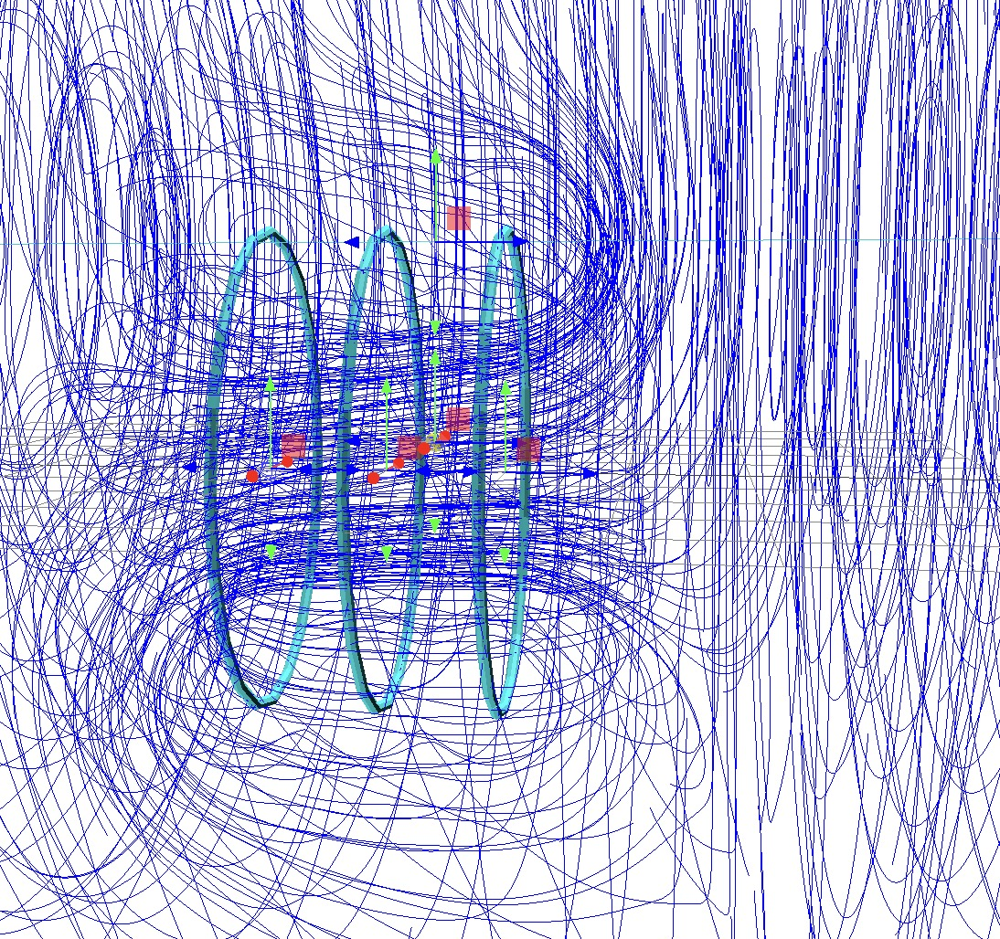

# PHYS/STS/ENST 282 Final Project

This is the source code of the final project of Chase Marangu for PHYS/STS/ENST 282 - Renewable Energy.
The objective of this project was to create a visualization tool which makes it easy to plot vector field lines (streamlines) of
 $\vec E$ and $\vec B$ fields, in particular, in the case of electrostatics and magnetostatics. The code is currently
 a prototype, and I hope to add numerous features to this project in the future.

 ## Using this code

 1) Open `index.html` in your favorite web browser (or visit <a href=https://chasemarangu.github.io/sts-282-final-project/>https://chasemarangu.github.io/sts-282-final-project/</a>)
 2) Click the buttons in the GUI to add different electric charge and current distributions.
 3) Drag on the red, green, and blue arrows (Three.js TransformControls) to move any object in the scene and see what the resulting vector field looks like.

Feel free to edit and share this code, and if you wish to reuse a significant portion of it, I ask that you kindly provide attribution to me via including a reference to
my name, a URL indicating where you obtained my source code, or similar.

